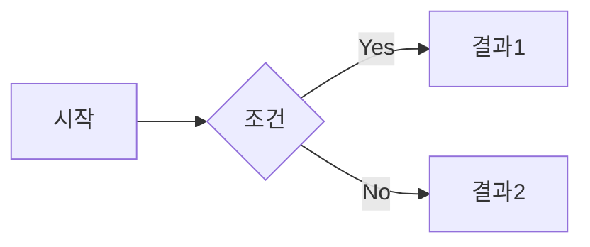

# 블로그 글 작성 가이드

## 파일 생성 규칙

- 위치: `_posts/` 디렉토리
- 파일명: `YYYY-MM-DD-제목-슬러그.md`
  ```
  2026-02-12-my-first-post.md
  2026-03-01-docker-basics.md
  ```
- 파일명에 한글 사용 가능하지만, 영문 소문자 + 하이픈 권장

---

## Front Matter (머리말)

모든 글 상단에 `---`로 감싼 YAML 메타데이터가 필요하다.

```yaml
---
title: "글 제목"
date: 2026-02-12 14:00:00 +0900
categories: [대분류, 소분류]
tags: [태그1, 태그2]
---
```

### 필수 항목

| 항목 | 설명 | 예시 |
|------|------|------|
| `title` | 글 제목 | `"Docker 입문 가이드"` |
| `date` | 작성일시 (+0900 = KST) | `2026-02-12 14:00:00 +0900` |
| `categories` | 카테고리 (최대 2단계) | `[Dev, Docker]` |
| `tags` | 태그 (여러 개 가능) | `[docker, container, devops]` |

### 선택 항목

```yaml
---
title: "글 제목"
date: 2026-02-12 14:00:00 +0900
categories: [Dev]
tags: [example]
description: "검색/미리보기에 표시될 요약"    # SEO 설명
author: eunkuk                                # 작성자 (기본값 사용 시 생략)
pin: true                                     # 홈 상단 고정
toc: false                                    # 목차 비활성화 (기본: true)
comments: false                               # 댓글 비활성화
math: true                                    # 수식 렌더링 활성화
mermaid: true                                 # Mermaid 다이어그램 활성화
image:
  path: /assets/img/posts/thumbnail.png       # 썸네일 이미지
  alt: "이미지 설명"
---
```

---

## Markdown 문법

### 제목

```markdown
## h2 제목
### h3 제목
#### h4 제목
```

> `# h1`은 사용하지 않는다. 글 제목(title)이 h1으로 자동 렌더링됨.

### 텍스트 스타일

```markdown
**굵게**
*기울임*
~~취소선~~
`인라인 코드`
```

### 링크 & 이미지

```markdown
[링크 텍스트](https://example.com)


{: width="400" }
```

이미지 파일은 `assets/img/posts/` 디렉토리에 저장한다.

### 코드 블록

````markdown
```python
def hello():
    print("Hello, World!")
```
````

지원 언어: `python`, `javascript`, `java`, `bash`, `sql`, `yaml`, `json`, `html`, `css`, `ruby`, `go`, `rust`, `c`, `cpp` 등

### 목록

```markdown
- 순서 없는 목록
- 항목 2
  - 중첩 항목

1. 순서 있는 목록
2. 항목 2
```

### 표

```markdown
| 헤더1 | 헤더2 | 헤더3 |
|-------|-------|-------|
| 값1   | 값2   | 값3   |
| 값4   | 값5   | 값6   |
```

### 인용문

```markdown
> 인용문 내용
> 여러 줄 가능
```

---

## Chirpy 전용 문법

### 프롬프트 블록 (강조 박스)

```markdown
> 팁 내용
{: .prompt-tip }

> 정보 내용
{: .prompt-info }

> 경고 내용
{: .prompt-warning }

> 위험 내용
{: .prompt-danger }
```

### 각주

```markdown
본문에서 각주 참조[^1]를 표시한다.

[^1]: 각주 내용이 여기에 표시된다.
```

### 수식 (math: true 필요)

```markdown
인라인: $E = mc^2$

블록:
$$
\sum_{i=1}^{n} x_i = x_1 + x_2 + \cdots + x_n
$$
```

### Mermaid 다이어그램 (mermaid: true 필요)

````markdown

````

### 파일 경로 강조

```markdown
`/etc/nginx/nginx.conf`{: .filepath}
```

---

## 카테고리 규칙

카테고리는 최대 2단계까지 지원된다.

```yaml
categories: [대분류]           # 1단계만
categories: [Dev, Docker]     # 2단계 (Dev > Docker)
```

예시 카테고리 구조:
```
Blog          - 블로그 관련
Dev           - 개발 전반
  ├── Setup   - 환경 설정
  ├── Docker  - Docker/컨테이너
  └── Web     - 웹 개발
TIL           - Today I Learned
```

---

## 새 글 작성 순서

1. `_posts/` 디렉토리에 `YYYY-MM-DD-slug.md` 파일 생성
2. Front matter 작성
3. Markdown으로 본문 작성
4. (이미지 있으면) `assets/img/posts/`에 이미지 파일 추가
5. Git commit & push → 자동 배포
