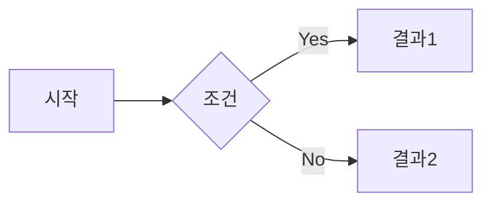

# 블로그 글 작성 가이드

이 문서는 이 블로그에서 실제로 쓰는 글 형식과 운영 규칙을 정리한 것이다.
단순한 Markdown 문법 설명보다, **어떤 글을 어떤 톤으로 쓸 것인가**에 더 초점을 둔다.

---

## 1. 기본 원칙

- 이 블로그는 튜토리얼보다 **실무 회고 / 설계 판단 / 트레이드오프 기록**에 가깝다.
- "정답 소개"보다 **왜 이 선택을 했는지**를 쓰는 편이 맞다.
- 문제를 일반론으로 풀기보다, **내가 겪은 제약과 실제 코드/구조**를 먼저 쓴다.
- 결론은 단정적으로 써도 되지만, 본문에서는 **포기한 것과 한계**까지 같이 적는다.

잘 맞는 주제 예시:

- 마이그레이션 회고
- 설계 경계 정리
- 데이터 모델링 선택
- 운영 중 겪은 문제와 수정 기준
- 내부 도구 / 자동화 / AI 실험 기록

약해지기 쉬운 방향:

- 교과서 요약
- 개념 백과사전식 설명
- 실제 제약 없는 추상적 패턴 소개
- "좋았다 / 별로였다"만 있는 툴 후기

---

## 2. 파일 생성 규칙

- 위치: `_posts/`
- 파일명: `YYYY-MM-DD-slug.md`
- 슬러그는 영문 소문자 + 하이픈 권장

예시:

```text
2026-03-16-pattern-language-llm-strategy-pattern.md
2026-03-13-gene-test-vendor-multi-tenancy-architecture.md
```

현재 블로그는 `_config.yml`에 `future: true`가 켜져 있으므로 미래 날짜 포스트도 빌드된다.
다만 공개 시점 기준으로 날짜가 정렬에 영향을 주므로, 파일명과 `date`는 항상 같이 맞춘다.

---

## 3. Front Matter 규칙

모든 글 상단에는 YAML front matter가 필요하다.

기본 예시:

```yaml
---
title: "스트래티지 패턴을 못 말했던 이유 — 설계 감각과 설계 언어는 다르다"
date: 2026-03-16 23:10:00 +0900
categories: [Architecture]
tags: [design-pattern, strategy-pattern, llm, abstraction, interview, software-design]
description: "면접에서 Strategy Pattern을 바로 설명하지 못했던 경험을 돌아본다. 추상화는 하고 있었지만 이름이 없었다. 패턴을 영단어처럼 외워야 하는지, LLM 시대에 설계 언어는 어떤 의미가 있는지 정리한다."
---
```

### 필수 항목

| 항목 | 설명 |
|------|------|
| `title` | 실제 제목 |
| `date` | 작성일시 (`+0900`) |
| `categories` | 카테고리 |
| `tags` | 세부 기술 태그 |

### 자주 쓰는 선택 항목

| 항목 | 설명 |
|------|------|
| `description` | 검색/미리보기용 요약 |
| `toc: false` | 목차를 숨기고 싶을 때 |
| `comments: false` | 댓글 비활성화 |
| `math: true` | 수식 사용 시 |
| `mermaid: true` | Mermaid 다이어그램 사용 시 |
| `image` | 썸네일 이미지 |

---

## 4. 카테고리 규칙

현재 기본 카테고리 체계는 다음과 같다.

```text
Architecture  - 설계, 계층, 패턴, 구조 선택
Backend       - API, 인증, 실시간 처리, 서버 구현
Database      - 데이터 모델링, 저장 구조, 쿼리
Infra         - 배포, 네트워크, 운영 이슈
Migration     - 레거시 전환, 호환 계층, 재설계
AI            - LLM, 에이전트, 자동화 툴링
Testing       - 테스트 전략, 검증, 품질 관리
```

권장 방식:

```yaml
categories: [Architecture]
```

2단계 카테고리는 정말 필요할 때만 쓴다.

```yaml
categories: [Architecture, DDD]
```

원칙:

- 카테고리는 큰 분류
- 태그는 세부 기술명
- 애매하면 카테고리는 더 넓게, 태그는 더 구체적으로

예시:

- `spring-boot`, `jpa`, `querydsl`, `jwt`는 보통 태그
- `Architecture`, `Migration`, `Testing`은 카테고리

---

## 5. 제목 규칙

이 블로그 제목은 보통 아래 패턴을 쓴다.

### 문제 → 원인/해결

```text
JWT 로그아웃했는데 토큰이 살아있다 — Redis 없이 무효화하기
PCM 오디오가 무음으로 재생됐다 — Little-Endian과 Big-Endian
```

### 선택지 → 판단 기준

```text
Method Naming → @Query → QueryDSL — 쿼리 복잡도에 따른 Repository 전략
유전자검사 서비스에 벤더사가 붙기 시작했다 — 멀티테넌시를 고민할 시점
```

### 회고형

```text
PHP CodeIgniter 프로젝트를 Spring Boot로 옮기기까지 — 마이그레이션 회고 (1) 왜 다시 만들었나
Python 스크립트 하나로 돌리던 유전자 분석을 데스크톱 앱으로 만들기까지 — GeneTitan Agent 회고
```

제목 원칙:

- 문제/맥락이 먼저 보여야 한다
- 뒤쪽에는 선택, 해결, 회고 포인트를 둔다
- 너무 추상적인 제목보다 **실제 상황이 보이는 제목**이 낫다

약한 제목 예시:

- `Strategy Pattern 정리`
- `멀티테넌시 개념`
- `DDD를 적용해보며`

강한 제목 예시:

- `스트래티지 패턴을 못 말했던 이유 — 설계 감각과 설계 언어는 다르다`
- `유전자검사 서비스에 벤더사가 붙기 시작했다 — 멀티테넌시를 고민할 시점`

---

## 6. 도입부 규칙

보통 글 시작은 다음 흐름을 따른다.

1. front matter
2. 한 줄 요약 blockquote
3. 구분선 `---`
4. `## 1. 상황`

예시:

```markdown
> 면접에서 `Strategy Pattern이 뭐냐`는 질문을 받았고, 순간 바로 대답하지 못했다. 그런데 설명을 듣는 순간 익숙한 코드가 떠올랐다.

---

## 1. 상황
```

도입부에서 해야 하는 것:

- 이 글이 어떤 문제에서 시작됐는지
- 왜 지금 이 얘기를 쓰는지
- 이미 쓴 다른 글과 연결되는지

도입부에서 피할 것:

- 너무 긴 배경 설명
- 교과서 정의부터 시작
- 결론 없이 맥락만 늘어놓기

---

## 7. 본문 구조 권장 패턴

글마다 다르지만, 이 블로그에서 잘 맞는 구조는 아래 셋이다.

### A. 회고형

```text
1. 상황
2. 문제 / 한계
3. 선택지 검토
4. 왜 이걸 골랐나
5. 구현 후 달라진 점
6. 대신 포기한 것들
7. 돌아보며 / 정리
```

### B. 설계 판단형

```text
1. 상황
2. 개념 또는 선택지 정의
3. 우리 상황의 진단
4. 실제 선택
5. 트레이드오프
6. 전환 시점 또는 확장 경로
7. 정리
```

### C. 트러블슈팅형

```text
1. 상황
2. 증상
3. 삽질
4. 원인 확인
5. 해결
6. 돌아보며
```

---

## 8. 문체 규칙

이 블로그 문체는 다음 쪽에 가깝다.

- 건조하고 직접적
- 실무 제약을 먼저 말함
- 단정적으로 쓰되, 근거를 같이 씀
- "좋았다"보다 "왜 그 선택을 했는가"를 강조

권장 표현:

- "기준이 필요했다"
- "이 시점부터 구조를 바꿔야 했다"
- "문제는 여기서 끝나지 않았다"
- "핵심은 단순하다"
- "지금 단계에서는 이 선택이 맞다고 봤다"

자주 넣으면 좋은 것:

- 실제 숫자
- 테이블 구조
- before/after 비교
- 코드 예시
- 포기한 선택지

약해지는 표현:

- "좋은 것 같다"
- "유연하다"
- "확장 가능하다"

위 표현은 가능하면 이렇게 바꾼다.

- 무엇에 유연한가
- 어디까지 확장 가능한가
- 어떤 비용을 줄였는가

---

## 9. 내부 링크 규칙

관련 글이 있으면 적극적으로 연결한다.

예시:

```markdown
> 이 글은 [DomainService vs Facade — 이 로직은 어디에 둬야 하는가](/posts/domain-service-vs-facade-boundary/)의 연장이다.
```

원칙:

- 시리즈 글은 앞 글/연관 글을 도입부에 연결
- 같은 주제를 다른 각도에서 다룬 글은 본문 중간에 연결
- 링크는 억지로 많이 넣기보다, 독자가 "다음에 읽을 글"을 자연스럽게 찾을 수 있게 배치

---

## 10. Markdown / Chirpy 실사용 규칙

### 제목

`# h1`은 쓰지 않는다. `title`이 자동으로 h1이 된다.

```markdown
## 1. 상황
### 왜 이걸 택했나
```

### 코드 블록

언어를 명시한다.

````markdown
```java
public interface ReportPolicy {}
```
````

### 링크와 이미지

```markdown
[관련 글](/posts/example-post/)

```

이미지는 `assets/img/posts/`에 둔다.

### 프롬프트 블록

```markdown
> 팁 내용
{: .prompt-tip }

> 경고 내용
{: .prompt-warning }
```

### Mermaid

`mermaid: true`가 필요하다.

````markdown

```mermaid
graph LR
  A[시작] --> B{조건}
  B -->|Yes| C[결과1]
  B -->|No| D[결과2]
```
````

### 파일 경로 강조

```markdown
`/etc/nginx/nginx.conf`{: .filepath}
```

---

## 11. 발행 전 체크리스트

- 파일명 날짜와 `date`가 일치하는가
- 카테고리가 현재 체계와 맞는가
- 태그가 너무 넓지 않고 구체적인가
- `description`이 들어갔는가
- 도입부 한 줄 요약이 있는가
- 본문에 실제 제약과 트레이드오프가 들어갔는가
- 관련 글 링크를 넣었는가
- 제목이 너무 추상적이지 않은가
- 코드 블록 언어가 지정됐는가

---

## 12. 새 글 작성 순서

1. `_posts/`에 `YYYY-MM-DD-slug.md` 생성
2. front matter 작성
3. 한 줄 요약 blockquote 작성
4. `## 1. 상황`부터 본문 전개
5. 관련 글 링크와 코드/표/예시 추가
6. 발행 전 체크리스트 확인
7. 빌드 후 이상 없으면 반영
